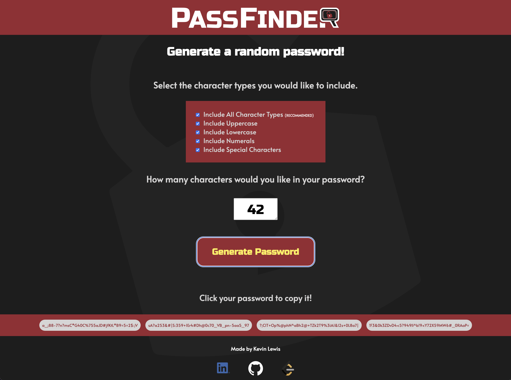

# **_PassFinder_**

 

## Overview

Tired of thinking of long, complex passwords? Use this single-page app to generate a password for you!
 

## Application Instructions

1. Visit https://candid-snickerdoodle-e60aa3.netlify.app/ 
2. Select the types of characters you would like to include in your password.
3. Enter a desired password length. 
4. Select the types of characters you'd like to include in your password. 
5. Click the "Generate Password" button. 

## App Screenshots

##

##

## Technologies Utilized

• HTML 
• CSS 
• JavaScript

## Contributors To This Application

Kevin Lewis

 

# **_Thank you for using this App!_**

## Contact me @...

&nbsp; kevdev@myyahoo.com

&nbsp; https://github.com/KPL33